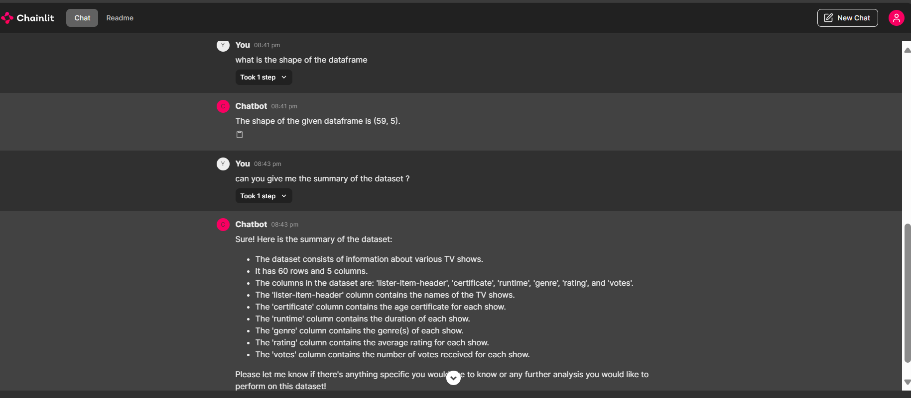

# OpenAI Chatbot using Chainlit

## How to run:

#### Step 1: 
* Create .env file with api_link, api_key, api_version, model
Description : api_link: endpoint, api_key: azure api key, api_version: api version(example: "2024-02-15-preview"), model: deployment name
### Without Docker:
#### Step 2: 
* pip install -r requirements.txt (to install all the required packages)
* chainlit run run.py (to run the code)

### With Docker:
#### Step 2:
* docker build -t chatbot ./  (to build the docker image)
* docker run -d -p 8000:8000 -e .env chatbot (to run the docker container using image)

## Output:
### Data Analysis:

### Normal conversation:

## Future work:
* Handling large csv files.
* Maintaining higher number of chain of thoughts.
* Worked on handling larger csv files with the help of embedding models (final_code.py file in async branch has the relevant implementation).

